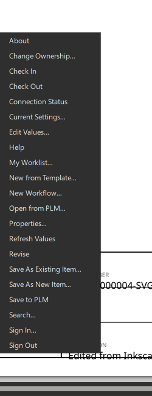
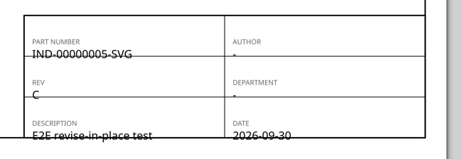

# Nexus PLM for Inkscape

[](LICENSE)

Product lifecycle management from inside Inkscape. Create a drawing from a PLM template, check it
out, edit its attributes, check it back in — without leaving Inkscape.



The add-in is a Python extension: one `.inx` per command under **Extensions ▸ Nexus PLM**, all
running the same script. It talks to the **Nexus PLM Addin Service** on `localhost:5100`, which
owns the dialogs and does the talking to the PLM server — so the same windows, wording and
behaviour appear in Inkscape, GIMP, QGIS, Word, LibreOffice, OpenOffice and ONLYOFFICE.

Tested against Inkscape **1.4.2** (bundled Python 3.12).

- **[User guide](docs/user-guide.md)** — every command, what it does, and where the values go.
- **[Developer guide](docs/developer-guide.md)** — how it is built, how to change it, what Inkscape
  does differently and how that shaped the design.

---

## What it does

Twenty-one commands, in the order the menu shows them (Inkscape sorts a submenu alphabetically):

| | |
|---|---|
| **Documents** | New from Template · Open from PLM · Search |
| **Saving** | Save to PLM · Save As New Item · Save As Existing Item |
| **Lifecycle** | Check Out · Check In · Revise · Change Ownership |
| **Workflow** | My Worklist · New Workflow |
| **Values** | Properties · Edit Values · Refresh Values |
| **Session** | Sign In · Sign Out · Current Settings · Connection Status · Help · About |

There is deliberately no Release: a revision reaches Released only by running a workflow, which
New Workflow starts.

A drawing created from a PLM template opens filled in — part number, revision, description, who
created it and when — because the type says which PLM attribute feeds which field.



## Where the values live

**The record is the point.** Every mapped attribute is written into the drawing's own
`<metadata>`, under the `https://nexusplm.com/ns/plm` namespace, and it survives a round trip
through Inkscape because Inkscape preserves foreign namespaces there. The attributes are *in*
the SVG — not in a sidecar or a database row keyed on a file name.

| | Where | |
|---|---|---|
| **The record** | `<metadata>` → `<nexus:attributes>` → `<nexus:value key="…">` | Every mapped value. Why this add-in exists. |
| Drawn on the sheet | a `<text>` whose `inkscape:label` is the attribute key | Optional. The template's title block uses it. |

A drawing with no labelled text still carries every value.

## How it fits together

```
Inkscape  ──►  nexus_plm.py --command …  ──►  nexusplm/commands.py  ──HTTP──►  Addin Service  ──►  Nexus PLM Engine
                (one .inx per command)              │                        (localhost:5100)      Vault, types, workflow
                                               nexusplm/svg.py                       │
                                          (the record in the drawing)      the dialogs a user sees live here,
                                                                           shared by every host
```

The extension keeps no business rules of its own. It says what it is (`HOST_NAME`) and what it can
open (`FILE_EXTENSIONS`) with every request — the service needs no code change to gain a host —
writes PLM's values into the drawing, and asks the service for everything else.

## Installing

Run `NexusPlmInkscapeAddinSetup.exe` from a [release](../../releases). Per user, no administrator
rights: it copies the extension into `%APPDATA%\inkscape\extensions`. Restart Inkscape and
**Extensions ▸ Nexus PLM** appears.

You also need the **Nexus PLM tray application** (`Nexus.PLM.WPF.Addins`) running — it hosts the
service the extension talks to, and it shows the dialogs.

## Building

```bash
cd extension
python build.py                 # regenerate the .inx files from the MENU table
python build.py --install       # …and copy into Inkscape's user extensions directory
python -m pytest ../tests -q    # 74 tests; need lxml and pytest, not Inkscape
"%ProgramFiles(x86)%\Inno Setup 6\ISCC.exe" ..\installer\Nexus.PLM.Inkscape.Addin.iss   # the installer
```

The `.inx` files are **generated**. Edit `MENU` in `build.py`, never the XML.

## Repository layout

| | |
|---|---|
| `extension/nexus_plm.py` | The entry point every `.inx` runs, with a different `--command`. |
| `extension/build.py` | The menu table; generates the `.inx` files and installs. |
| `extension/nexusplm/commands.py` | One function per command — the whole surface a user touches. |
| `extension/nexusplm/svg.py` | Where a PLM value lives in a drawing: the record, the labelled text, a staged file. |
| `extension/nexusplm/host.py` | The parts that know they are inside Inkscape. |
| `extension/nexusplm/{client,state,identity,navigator}.py` | Shared with the GIMP and QGIS add-ins; no Inkscape API in any of them. |
| `tools/build_template.py` | Makes `dist/Inkscape Drawing.svg`, the type's template. |
| `tests/` | pytest, runs without Inkscape. |
| `installer/` | Inno Setup script; `tests/test_installer.py` holds it against the source. |

## Design notes

Things that cost something to learn, kept here so they are not learned twice. All measured on
1.4.2, not assumed.

**An extension is handed a copy, not the file.** `input_file` is a temporary `ink_ext_XXXXXX.svg`
and the edited result goes back to Inkscape on stdout. `DOCUMENT_PATH` does give the real saved
path, so identity works as in every other host.

**Uploads write the drawing on screen to the drawing's own file.** An extension cannot ask
Inkscape to save, and comparing disk with screen refuses drawings nobody touched (Inkscape's
in-memory document always differs from its file). So Save to PLM writes Inkscape's own current
buffer over the document's path and uploads that. Not a temp copy: the service records the path it
is given as the item's home, and a temp path became the next revision's home.

**Revise ups the revision in place.** The service stages the next revision under the same file
name; the extension hands that file back as its own output, and the window the user is looking at
becomes the new revision. inkex needs a tree parsed by its own loader for that — bytes pass `save`
but not `has_changed`, and are dropped without a word.

**`needs-document="false"` kills the command.** An `EffectExtension` with no document dies inside
inkex's own loader and Inkscape shows the traceback. Every entry needs a document; a test holds it.

**stderr is a user interface.** Inkscape shows an extension's stderr in a dialog, so a stray Python
warning reads as a broken add-in. Warnings are silenced at the entry point, and `commands.run`
turns anything unexpected into a toast.

**`implements-custom-gui="true"`** is what stops Inkscape drawing its own small "working…" window
for the whole time a Nexus dialog is open.

## Contributing

Issues and pull requests are welcome. Keep a change and its test together, run the tests before
opening a pull request, and say *why* in the commit body. Work goes on a branch and is merged
through `next`.

## License

MIT — see [LICENSE](LICENSE).
